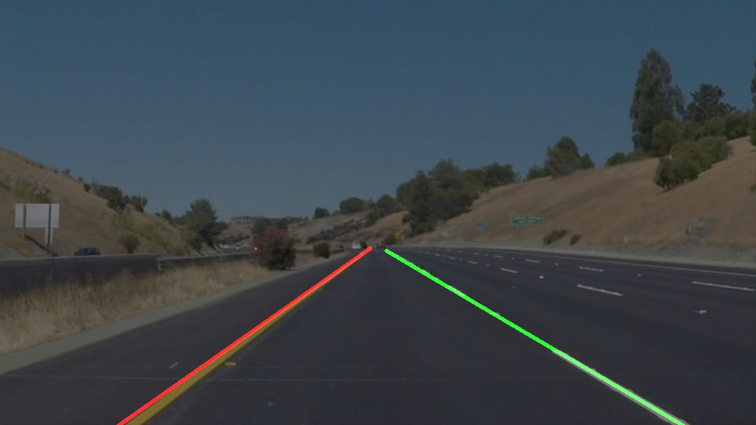

# Finding Lane Lines on the Road

### The goals / steps of this project are the following:
- Make a pipeline that finds lane lines on the road
- Reflect on your work in a written report
## Reflection
### The Pipeline
The pipeline consisted of the following steps:
1. Grayscale,
2. Gaussian blur (kernel_size = 3),
3. Canny edge detection (low/high = 50/150),
4. Applying the Region of Interest mask,
5. Hough Transform (rho=1, theta=np.pi/180*1, threshold=50, min_line_len=15, max_line_gap=3),
6. Adding, if any, weighted detected lane lines from previous images (FRAMES_TO_KEEP) to the Hough line set,
7. Calculating lane lines for the given image using lines produced at steps #e-f.
8. Adding deduced at #g lines to the rolling buffer for post-processing at #f.
9. Drawing the resulting lane lines (left-green, right-red, historical-blue)

In order to draw a single line on the left and right lanes, I modified the code so draw_lane_lines() function calculates weighted averages separately for the non-vertical and not too horizontal lines of negative (North-East facing) and positive (North-West facing) slopes, where weights are equal to square of segment Euclidian length in pixels. The set of input lines might include weighted lane lines detected in previous video frames (see process_image() and previous_line_eqs rolling buffer management).

#### Potential shortcomings with current pipeline

Need more testing in the following areas:

1. Adversarial weather conditions: What if it’s
  a. snowing,
  b. raining,  
  c. driving against the sun / sun flares,
  d. lane markings are covered with snow, mud, water,
  e. tree shadows,
  f. vibrations.
  b. driving in the dark,
  c. driving in the dark with oncoming traffic with a lot of light intensity fluctuations,
  d. driving in traffic with most of the lane markings blocked by other vehicles,
  e. changing lanes,
  f. complex intersections, e.g. with railroad crossings,
  g. crossing pedestrian crossings,
  h. steep slopes / hard curves,
  i. letters, arrows painted on the lane.
  
#### Possible improvements to the pipeline
- Deduce lanes by taking into account nearby vehicles - might be useful on roads with no lane markings.

- Train a neural network to produce parameters for Hough Transform, Canny, etc which fit best current conditions (weather, time of day, type of road, etc).
